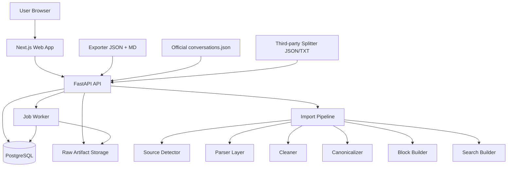

# Design Document: ChatGPT 导出对话阅读器

## Overview

ChatGPT 导出对话阅读器是一个面向 ChatGPT 导出内容的 AI 对话知识库系统。系统支持多种来源导入，包括 ChatGPT Exporter JSON + Markdown、官方 `conversations.json`、官方单 conversation JSON、第三方 splitter JSON/TXT、CSV，并将所有来源转换成统一的 Canonical Conversation Format。

系统的核心不是复刻 ChatGPT 的对话生成能力，而是为用户提供长期阅读、整理、搜索、编辑、合并、分享和归档体验。

核心原则：

```text
JSON + Markdown 是阅读质量来源
官方 conversations.json 是结构完整来源
Canonical Format 是长期稳定存储格式
前端只渲染 Canonical blocks，不直接渲染原始文件
```

## Architecture

### System Overview



### Component Architecture

主要组件：

1. **Web App**：Next.js + React + TypeScript，负责阅读器、Project 导航、导入预览、搜索、编辑、分享。
2. **API Service**：FastAPI，负责业务 API、导入预览、导入任务、搜索、导出、分享。
3. **Import Pipeline**：解析来源、清洗、标准化、构建 blocks、索引。
4. **Canonical Storage**：PostgreSQL + JSONB，保存长期稳定数据。
5. **Read Model**：render_blocks、headings、search_documents、conversation list projection。
6. **Job Worker**：处理大文件导入、搜索重建、批量导出。

### Data Flow

```text
Source File
↓
Upload / Import Preview
↓
Source Detector
↓
Parser
  - Exporter JSON Parser
  - Markdown Parser
  - Official JSON Parser
  - Third-party Splitter Parser
↓
Aligner / PrimaryPathResolver
↓
Cleaner
↓
Canonicalizer
↓
BlockBuilder / HeadingBuilder / SearchBuilder
↓
PostgreSQL
↓
Next.js Reader
```

### Technology Decisions

- Frontend：Next.js + React + TypeScript。
- Styling：Tailwind CSS。
- Client data：TanStack Query。
- Virtualization：TanStack Virtual。
- UI state：Zustand。
- Backend：FastAPI。
- Database：PostgreSQL + JSONB。
- ORM / Migration：SQLAlchemy 2.x + Alembic。
- Search：PostgreSQL Full Text Search；后续可扩展 Meilisearch / Typesense / Vector Search。

## Components and Interfaces

### SourceDetector

**Purpose:** 判断上传文件属于哪种来源类型。

**Responsibilities:**
- 识别 ChatGPT Exporter JSON。
- 识别 Exporter Markdown。
- 识别官方完整 conversations.json。
- 识别官方单 conversation JSON。
- 识别第三方 splitter JSON/TXT。
- 输出 source_profile 和 confidence。

**Interface:**

```python
class SourceDetector:
    def detect(self, file: UploadedFile) -> SourceDetectionResult: ...
```

### ExporterJsonParser

**Purpose:** 解析 ChatGPT Exporter JSON。

**Input:** JSON with metadata + messages。

**Output:** ParsedConversationDraft。

### MarkdownParser

**Purpose:** 解析 Exporter Markdown 的 Prompt / Response 分区和 Markdown blocks。

**Input:** Markdown text。

**Output:** ParsedMarkdownDraft。

### JsonMarkdownAligner

**Purpose:** 将 Exporter JSON 消息与 Markdown 分区对齐。

**Matching Strategy:**

```text
external conversation id
metadata title + createdAt
message content hash
role + time proximity
filename similarity
fallback partial alignment
```

### OfficialJsonParser

**Purpose:** 解析官方 conversations.json。

**Responsibilities:**
- 支持完整 conversations array。
- 支持单 conversation object。
- 提取 mapping、current_node、message、metadata。

### PrimaryPathResolver

**Purpose:** 从 official mapping 中确定默认主线。

**Algorithm:**
1. 找到 current_node。
2. 沿 parent 指针回溯到 root。
3. 反转为 root -> current 顺序。
4. 过滤空 message / unsupported node。
5. 非主线 children 保存到 source_message_refs。

### Cleaner

**Purpose:** 清洗导出噪声。

**Responsibilities:**
- 删除导出思考摘要。
- 过滤空消息。
- 归一化换行。
- 保留 raw artifact。
- 输出 warnings。

### Canonicalizer

**Purpose:** 将不同来源转成 Conversation / Message / MessageVersion。

### BlockBuilder

**Purpose:** 将 displayText 转成 RenderBlock。

### SearchBuilder

**Purpose:** 构建 search_documents 和 PostgreSQL tsvector。

## Data Models

### Core Entities

- Conversation
- Message
- MessageVersion
- RenderBlock
- Heading
- SearchDocument
- ImportRecord
- SourceArtifact
- SourceMessageRef
- Project
- ProjectConversation
- ConversationEvent
- ReadingPosition
- Share
- Job

完整 JSON Schema 见 `schemas/canonical_conversation.schema.json`。
完整 SQL 草案见 `schemas/database_schema.sql`。

## Error Handling

### Error Categories

1. **Source Detection Error**：无法识别来源类型。
2. **Parse Error**：JSON/Markdown 解析失败。
3. **Alignment Error**：JSON 和 Markdown 无法完全配对。
4. **Official Graph Error**：缺失 mapping/current_node。
5. **Cleaner Error**：清洗失败但应保留 raw artifact。
6. **Persistence Error**：数据库写入失败。
7. **Search Index Error**：索引构建失败。
8. **Permission Error**：访问分享或 raw artifact 无权限。

### Strategy

| Error Type | HTTP Code | User Message | System Action |
|---|---:|---|---|
| Unsupported source | 400 | 未识别文件格式 | 保存预览错误，不写入 canonical |
| Invalid JSON | 400 | JSON 无法解析 | 返回具体行列信息 |
| Partial alignment | 200/409 | JSON 与 Markdown 仅部分匹配 | 允许 JSON-only 或 partial import |
| Missing current_node | 422 | 官方 JSON 缺少主线节点 | 尝试 fallback root traversal |
| DB error | 500 | 保存失败 | job 标记 failed，保留日志 |
| Search index error | 202 | 导入成功但搜索索引待重建 | 创建 rebuild job |

## Testing Strategy

### Unit Testing

- SourceDetector fixture tests。
- ExporterJsonParser tests。
- MarkdownParser tests。
- JsonMarkdownAligner exact / partial / mismatch tests。
- OfficialJsonParser mapping tests。
- PrimaryPathResolver branch tests。
- Cleaner thinking-summary removal tests。
- BlockBuilder markdown block tests。

### Integration Testing

- Import preview API。
- Import commit job。
- Project + conversation API。
- Search API。
- Export API。

### End-to-End Testing

- 上传 JSON + MD -> 预览 -> 导入 -> 阅读。
- 上传官方 conversations.json -> 拆分 -> 导入 -> 阅读。
- 搜索关键词 -> 跳转命中 block。
- 编辑消息 -> 版本历史 -> 回退。

### Performance Testing

- 500 messages conversation。
- 2000 messages official export。
- 100MB+ source artifact preview。
- Search index rebuild。

## Quality Checklist

- [ ] 所有来源都能转换为 Canonical Format。
- [ ] 前端不依赖原始导出文件。
- [ ] raw source artifact 可追溯。
- [ ] 官方 mapping 的 node / branch 信息不丢失。
- [ ] 搜索和目录不依赖 DOM。
- [ ] 编辑不覆盖原版本。
- [ ] 大对话不会全量 DOM 渲染。
