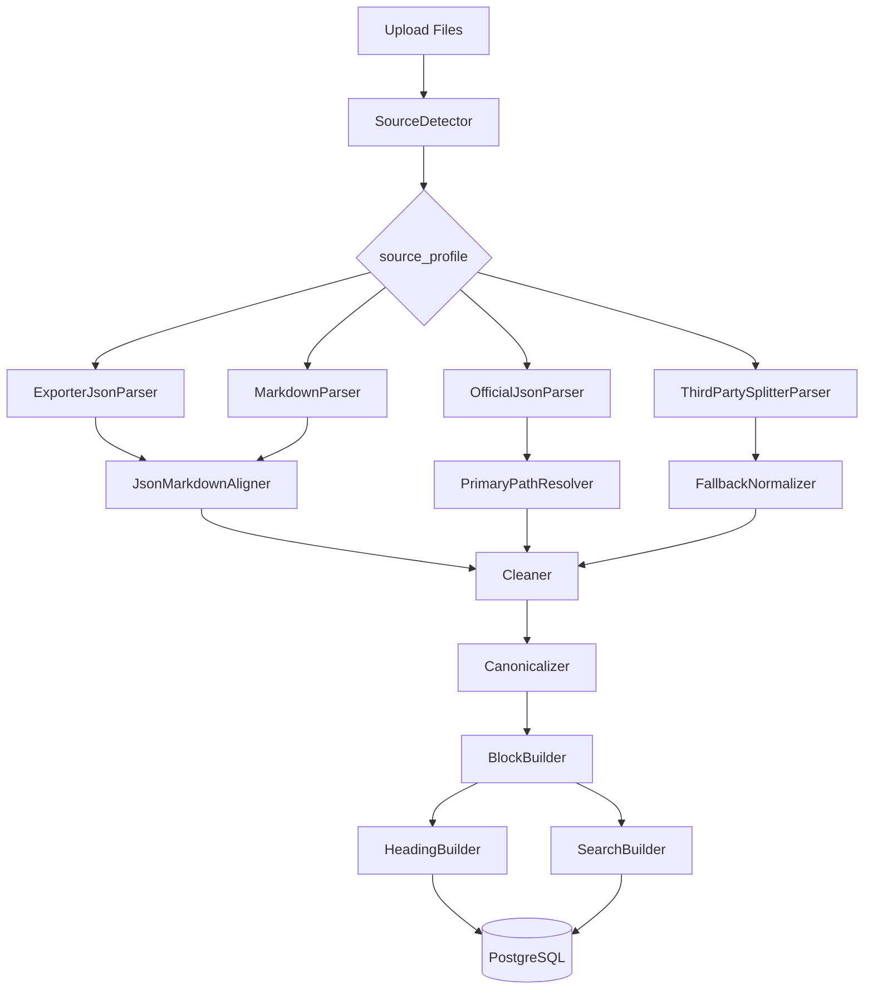

# Design Document: Source Import Pipeline

## Overview

导入系统是项目的核心。它必须支持多来源、多格式、多质量的输入，并稳定转换成统一 Canonical Format。

支持来源：

```text
ChatGPT Exporter JSON
ChatGPT Exporter Markdown
ChatGPT Exporter JSON + Markdown combo
官方 conversations.json
官方单 conversation JSON
第三方 splitter JSON / TXT
CSV fallback
```

## Architecture



## Components and Interfaces

### SourceDetector

检测规则：

| Source Profile | Detection Rule |
|---|---|
| chatgpt_exporter_json_only | JSON has `metadata.powered_by` and `messages[].role/say/time` |
| chatgpt_exporter_md_only | Markdown has `## Prompt:` / `## Response:` sections |
| chatgpt_exporter_combo | JSON + MD share external id/title/time/content hash |
| official_conversations_json | JSON array with conversation objects containing `mapping` |
| official_conversation_json | JSON object with `mapping` and `current_node` |
| third_party_splitter | JSON/TXT generated from official export but without full mapping |

### JsonMarkdownAligner

匹配优先级：

```text
external id > title + createdAt > content hash > role + time > filename similarity
```

输出 alignment_status：

```text
exact_match
partial_match
json_only
md_only
conflict_detected
failed
```

### Official Primary Path Resolver

官方 mapping 是树，不是数组。默认主线必须从 current_node 反向回溯：

```python
def resolve_primary_path(mapping, current_node):
    node_ids = []
    cursor = current_node
    while cursor and cursor in mapping:
        node_ids.append(cursor)
        cursor = mapping[cursor].get('parent')
    return list(reversed(node_ids))
```

非主线分支不进入默认阅读，但保存 source_message_refs。

## Data Models

### ImportPreview

```json
{
  "sourceProfile": "chatgpt_exporter_combo",
  "detectedTitle": "社交训练",
  "messageCount": 42,
  "promptCount": 21,
  "responseCount": 21,
  "hasMarkdownPair": true,
  "hasOfficialMapping": false,
  "hasBranches": false,
  "cleanedThinkingSummaryCount": 3,
  "emptyMessageCount": 1,
  "alignmentStatus": "partial_match",
  "warnings": []
}
```

## Error Handling

| Scenario | Strategy |
|---|---|
| JSON invalid | Return parse error with location |
| MD section count mismatch | Allow JSON-only or partial import |
| Official mapping missing | Try fallback sorted messages; mark warning |
| current_node missing | Try latest leaf node; mark warning |
| Empty messages | Filter and record warning |
| Thinking summary uncertain | Only remove high-confidence leading summary |

## Testing Strategy

- Fixture: exact JSON + MD pair。
- Fixture: JSON newer than MD。
- Fixture: MD newer than JSON。
- Fixture: official conversations array。
- Fixture: official conversation with regenerate branch。
- Fixture: empty assistant message。
- Fixture: thinking summary at Response start。
