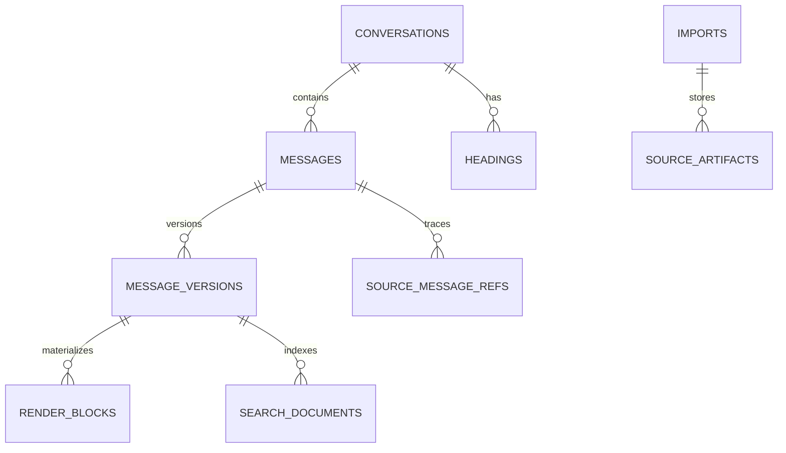

# Design Document: Canonical Conversation Format

## Overview

Canonical Conversation Format 是系统内部长期稳定格式。所有来源必须转换到该格式，前端、搜索、编辑、导出都依赖它，而不是依赖原始 JSON / Markdown。

## Architecture



## Components and Interfaces

### Conversation

代表一个导入后的对话，不等于原始文件。

关键字段：

```text
source_type
source_profile
external_source_id
parser_version
render_version
content_hash
sort_time
```

### Message

代表消息的位置、角色、顺序和当前版本指针。

### MessageVersion

代表正文版本。导入、编辑、清洗、拆分、合并都会产生版本。

### RenderBlock

代表可渲染 block。用于前端阅读、虚拟滚动、搜索定位。

### SourceMessageRef

保留官方 node / branch 溯源，避免 canonical 线性化后丢失原始结构。

## Data Models

完整 JSON Schema 见 `schemas/canonical_conversation.schema.json`。

## Error Handling

- Canonicalizer 不应吞掉源错误，必须把 warnings 写入 import record。
- RenderBlock 构建失败时，应降级为 paragraph block。
- 不支持的 official content type，应降级为 attachment/tool_call placeholder。

## Testing Strategy

- Snapshot test canonical JSON。
- Hash stability test。
- Version increment test。
- Source ref preservation test。
- RenderBlock fallback test。
