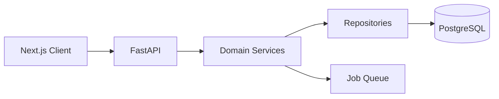

# Design Document: API Design

## Overview

API 使用 REST 风格。第一版不使用 GraphQL，原因是资源模型清晰、CRUD 与任务型接口明确、团队工具链成熟。

## Architecture



## Components and Interfaces

### Import API

```http
POST /api/imports/preview
POST /api/imports
GET  /api/imports/{job_id}
GET  /api/imports/{import_id}/warnings
GET  /api/imports/{import_id}/source-artifacts
```

### Conversation API

```http
GET    /api/conversations
GET    /api/conversations/{conversation_id}
PATCH  /api/conversations/{conversation_id}
DELETE /api/conversations/{conversation_id}
GET    /api/conversations/{conversation_id}/headings
GET    /api/conversations/{conversation_id}/messages?cursor=xxx&limit=30
GET    /api/conversations/{conversation_id}/source
GET    /api/conversations/{conversation_id}/branches
```

### Message API

```http
GET    /api/messages/{message_id}
GET    /api/messages/{message_id}/blocks?start=0&limit=50
POST   /api/messages/blocks/batch
PATCH  /api/messages/{message_id}
DELETE /api/messages/{message_id}
POST   /api/messages/{message_id}/restore
GET    /api/messages/{message_id}/versions
POST   /api/messages/{message_id}/versions/{version_id}/restore
```

### Search API

```http
GET /api/search?q=关键词&projectId=xxx&conversationId=xxx&role=user&blockType=code
```

## Error Handling

统一错误响应：

```json
{
  "error": {
    "code": "IMPORT_PARTIAL_ALIGNMENT",
    "message": "JSON 与 Markdown 只部分匹配",
    "details": {},
    "retryable": false
  }
}
```

## Testing Strategy

- Contract tests with OpenAPI schema。
- FastAPI integration tests。
- Error response snapshot tests。
- Pagination cursor tests。
- Authorization tests for shares/raw artifacts。
