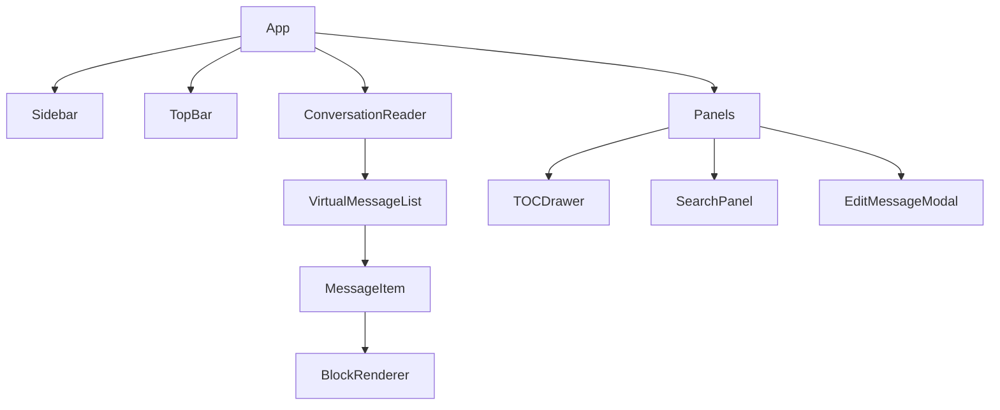

# Design Document: Frontend Reader

## Overview

前端目标是提供接近 ChatGPT 官网的阅读体验，但不提供输入框和生成能力。重点是阅读、目录、搜索、复制、编辑入口、继续阅读和移动端适配。

## Architecture



## Components and Interfaces

### Sidebar

负责 Project、会话列表、导入入口、全局搜索入口。

### TopBar

展示当前会话标题、目录、搜索、分享、更多菜单。

### ConversationReader

负责拉取 messages、维护虚拟滚动、恢复阅读位置。

### MessageItem

展示消息头、角色、时间、正文 blocks、操作按钮。

### BlockRenderer

根据 RenderBlock 类型渲染 paragraph、heading、blockquote、list、code、table、hr、attachment、tool_call。

## Data Models

前端主要 DTO：

```ts
interface ConversationListItem {
  id: string;
  projectId?: string;
  title: string;
  messageCount: number;
  updatedAt?: string;
  isPinned: boolean;
  hasImportWarnings: boolean;
  lastReadAt?: string;
  lastMessagePreview?: string;
}
```

## Error Handling

- 会话加载失败：显示 retry。
- message page 加载失败：保留已加载内容，局部 retry。
- block 渲染失败：降级显示 plain text。
- 导入 warning：在标题或更多菜单显示提示。

## Testing Strategy

- Component tests for BlockRenderer。
- Virtual list behavior tests。
- E2E: open conversation -> scroll -> reading position saved。
- E2E: search result -> jump to block。
- Mobile viewport tests。
