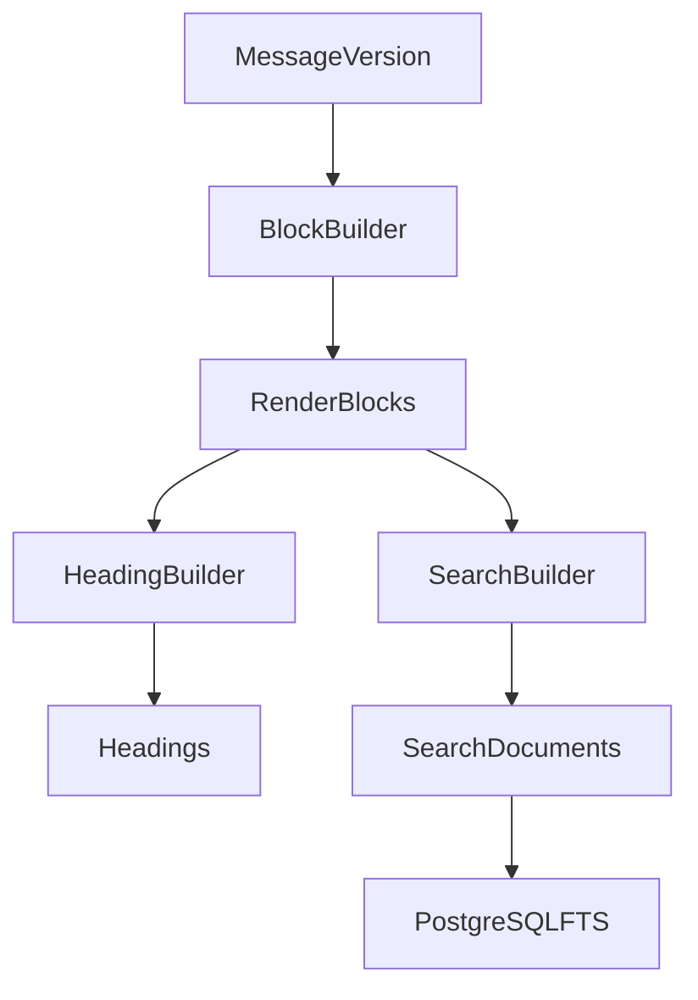

# Design Document: Search and TOC

## Overview

搜索和目录是知识库核心能力。它们不能依赖 DOM 扫描，而必须在导入或编辑保存时由后端生成。

## Architecture



## Components and Interfaces

### HeadingBuilder

从 RenderBlock 中提取 heading，生成 anchor 和 order_key。

### SearchBuilder

将 conversation title、message plain text、block plain text、tags、notes 写入 search_documents。

### SearchService

提供当前会话、Project、全局搜索。

## Data Models

### SearchResult

```ts
interface SearchResult {
  conversationId: string;
  projectId?: string;
  messageId?: string;
  messageVersionId?: string;
  blockIndex?: number;
  role?: string;
  blockType?: string;
  title?: string;
  snippet: string;
  rank: number;
}
```

## Error Handling

- 搜索索引缺失：触发 rebuild job。
- blockIndex 失效：跳转 message 顶部。
- conversation 已删除：不返回结果。

## Testing Strategy

- Heading extraction tests。
- Search ranking tests。
- Role filter tests。
- Block type filter tests。
- Search jump E2E。
