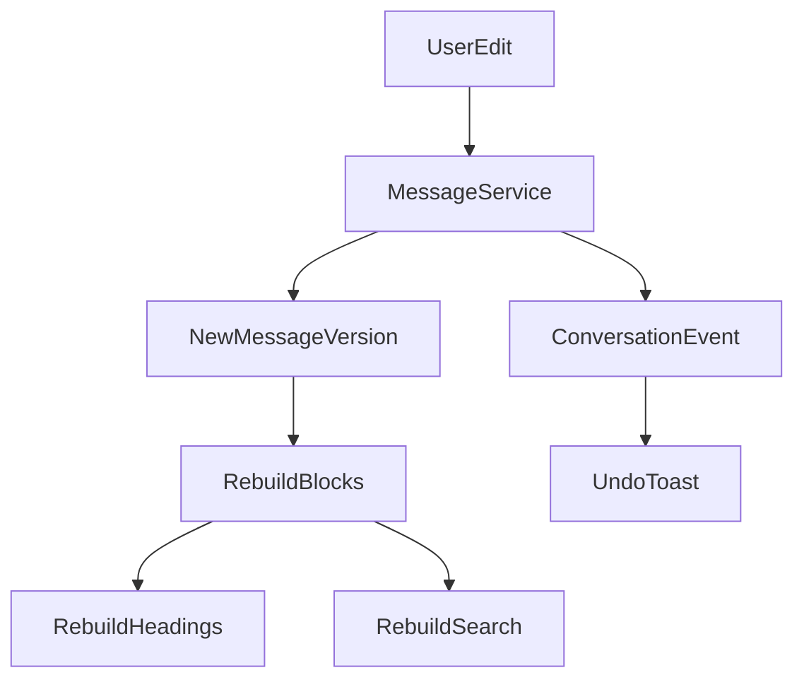

# Design Document: Editing, Versioning, and Undo

## Overview

编辑系统必须允许用户修改导入后的内容，但不能破坏原始记录。所有编辑通过 message_versions 和 conversation_events 记录。

## Architecture



## Components and Interfaces

### MessageService

接口：

```ts
interface MessageService {
  editMessage(messageId: string, patch: MessageEdit): Promise<MessageVersion>;
  deleteMessage(messageId: string): Promise<void>;
  restoreMessage(messageId: string): Promise<void>;
  splitMessage(messageId: string, splitAt: SplitPoint): Promise<Message[]>;
  mergeMessages(messageIds: string[]): Promise<Message>;
}
```

### VersionService

负责版本列表、版本恢复、版本 diff 的未来扩展。

### EventService

记录 conversation_events，用于审计和 undo。

## Data Models

- message_versions：正文版本。
- conversation_events：操作日志。
- messages.current_version_id：当前版本指针。

## Error Handling

| Scenario | Strategy |
|---|---|
| 编辑空内容 | 阻止或允许转为空 note，按角色决定 |
| 版本冲突 | 使用 updated_at/current_version_id 乐观锁 |
| 搜索重建失败 | 编辑成功，搜索标记待重建 |
| Undo 超时 | 提示只能从版本历史恢复 |

## Testing Strategy

- Edit creates new version。
- Restore version changes current_version_id。
- Delete is soft delete。
- Split preserves order_key。
- Merge records source message ids。
- Undo event test。
