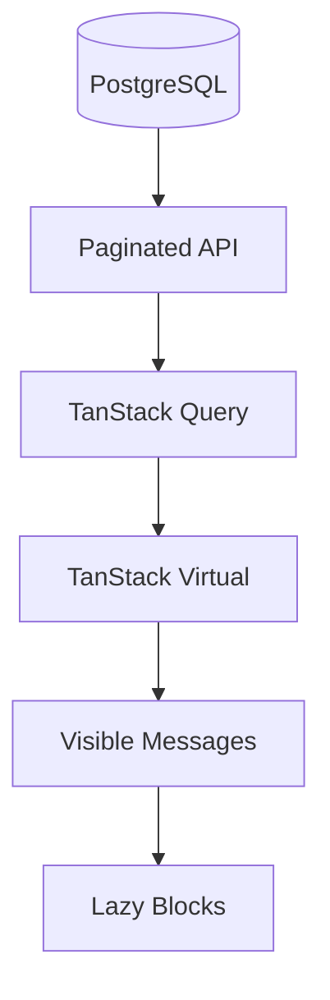

# Design Document: Performance

## Overview

系统必须能处理大对话、大导出、大量 Project 与搜索结果。性能设计重点是分片接口、虚拟滚动、预处理和 read model。

## Architecture



## Components and Interfaces

### Pagination

- Conversation messages 使用 cursor + limit。
- Blocks 使用 message_id + start + limit。
- 搜索使用 limit + offset/cursor。

### Virtualization

- 消息级虚拟滚动为默认。
- heavy message 启用 block 级懒渲染。
- 保存 estimated_height 和 measured_height。

### Read Model

左侧栏不 join 重表，读取 conversation list projection。

## Performance Targets

```text
左侧栏首次加载：< 500ms
普通会话首屏：< 800ms
大对话首屏：< 1500ms
当前会话搜索：< 500ms
全局搜索：< 1500ms
单条编辑保存：< 800ms
```

## Error Handling

- 请求取消避免旧响应覆盖新页面。
- 加载超时显示 skeleton + retry。
- 搜索慢查询记录日志。

## Testing Strategy

- Generate synthetic 500/2000 message conversations。
- Frontend scroll FPS profiling。
- API pagination benchmark。
- Search benchmark。
