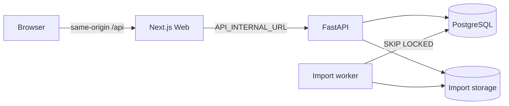

# 系统架构

## 总览



浏览器始终请求 Web 当前 origin 下的 `/api/*`。Next.js rewrite 在服务端把请求转发给 FastAPI，因此 localhost、局域网和生产域名使用同一客户端代码，也不会把 `localhost:8000` 暴露给远端浏览器。

## 代码边界

- `apps/web/app`：Next.js 页面、布局、PWA manifest 和 route UI。
- `apps/web/features`：reader、import、search、projects、sharing 等客户端能力。
- `apps/web/lib`：API client、query provider 和共享工具。
- `apps/api/app/api/routes`：HTTP 接口。
- `apps/api/app/services`：导入、canonical、搜索、编辑、分享和导出逻辑。
- `apps/api/app/models`：SQLAlchemy 持久化模型。
- `apps/api/alembic`：数据库版本演进。

## Canonical 模型

核心关系如下：

```text
Import -> SourceArtifact
Conversation -> Message -> MessageVersion -> RenderBlock
Conversation -> Heading
Conversation/MessageVersion -> SearchDocument
Conversation <-> Project
Conversation -> ConversationEvent / Share / ReadingPosition
```

- `Conversation` 保存标题、来源、状态、统计和全局置顶信息。
- `Message` 保存角色、顺序、turn 和当前版本引用。
- `MessageVersion` 保存不可变文本快照、hash 和编辑来源。
- `RenderBlock` 是阅读 read model，包含 heading、paragraph、list、code、table 等结构。
- `SourceMessageRef` 保留导入源节点追踪信息。
- `Heading` 和 `SearchDocument` 在导入或编辑后重建，不依赖浏览器扫描 DOM。

## 导入流程

```text
upload -> detect -> parse preview/warnings -> enqueue (202)
worker -> align JSON/Markdown -> clean -> canonicalize
       -> blocks -> headings -> search -> atomic publish
```

Import queue 持久化在 PostgreSQL。独立单并发 worker 使用 `FOR UPDATE SKIP LOCKED` 领取任务，并写入阶段、百分比、消息计数和 heartbeat；崩溃任务超过五分钟会重新排队。导入主体在 worker 事务中完成，conversation 在成功前保持 `importing`，不会进入列表、搜索或分享。

大批量 `RenderBlock`、`Heading` 和 `SearchDocument` 在 PostgreSQL 使用 COPY；SQLite 测试使用 SQLAlchemy Core fallback。导入版本的 `MessageVersion.blocks` 保持兼容但写入空数组，正式 block 来源为 `render_blocks`，避免双份 JSON。

raw artifact 存在受控 storage 中，只用于追踪和诊断。reader 和 share 页面不直接渲染 raw artifact。官方 conversations JSON 选择 primary path 形成线性阅读内容，分支节点引用仍可追踪。

## 阅读与性能

- `message-window` 返回分页窗口，并支持通过 `anchor_message_id` 或 `anchor_order_key` 直接取得包含目标的窗口。
- heavy message 首先返回轻量消息元数据；用户展开或导航到 block 时再调用 message blocks API。
- block cache 以 message id 为键复用结果。
- 导航等待目标挂载、布局稳定并校验 scroll root 中的位置，必要时补偿滚动。
- 当前方案不是严格的虚拟列表：长会话仍会随窗口合并增加 DOM 数量。

## Markdown 安全

renderer 使用 React 组件和受控 Markdown pipeline，禁止 raw HTML 执行，不使用 `dangerouslySetInnerHTML` 渲染导入内容。链接限制协议，未知外部图片不会直接热加载。Mermaid 在客户端初始化，失败时回退为代码内容。

## 搜索

PostgreSQL `search_documents` 同时支持全文排名和大小写不敏感 substring。substring 对中文、`package.json`、URL 和标点查询尤其重要。搜索结果只引用 canonical conversation/message/heading，不索引 raw artifact。

## 编辑和版本

编辑、拆分、合并和恢复都保留旧 MessageVersion。写操作完成后重建当前版本的 blocks、headings 和 search documents，并写入 ConversationEvent。会话 merge/split 创建新 conversation，不修改来源会话。

## 分享和导出

Share 只保存 token hash；公开 token 仅在创建时返回。访问接口提供只读 canonical 数据并记录访问次数。导出服务从 canonical 当前状态生成 Markdown 或 Canonical JSON。

## 部署边界

production compose 将 PostgreSQL 和 API 置于内部 Docker network，只暴露 Web。Nginx/Caddy 应作为公网入口负责 TLS、请求体限制和访问控制。当前应用本身没有用户认证，不能仅依靠不可猜测 URL 保护全部数据。
