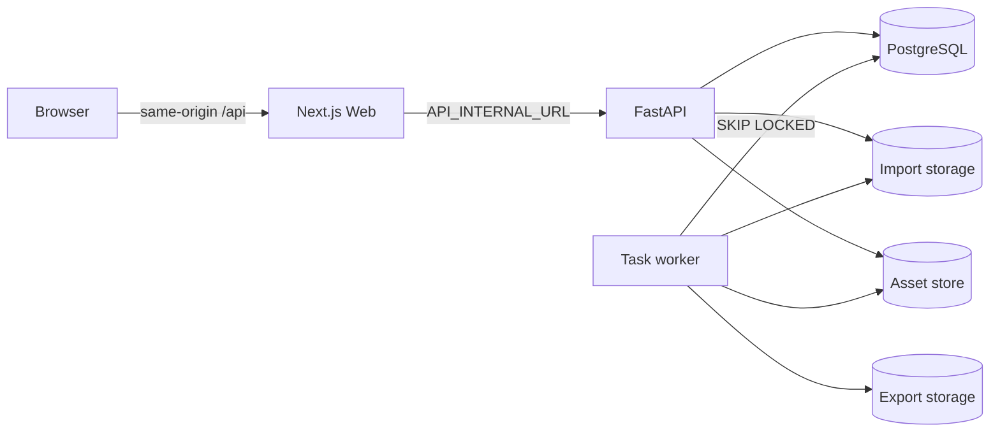

# 系统架构

最后核验：2026-08-05

## 总览


```mermaid
flowchart LR
  B[Browser] -->|same-origin /api| W[Next.js Web]
  W -->|API_INTERNAL_URL| A[FastAPI]
  A --> P[(PostgreSQL)]
  A --> S[(Import storage)]
  A --> X[(Asset store)]
  Q[Task worker] -->|SKIP LOCKED| P
  Q --> S
  Q --> E[(Export storage)]
  Q --> X
```

浏览器始终请求 Web 当前 origin 下的 `/api/*`。Next.js rewrite 在服务端把请求转发给 FastAPI，因此 localhost、局域网和生产域名使用同一客户端代码，也不会把 `localhost:8000` 暴露给远端浏览器。

## 代码边界

- `apps/web/app`：Next.js 页面、布局、PWA manifest 和 route UI。
- `apps/web/features`：reader、import、search、projects、sharing 等客户端能力。
- `apps/web/lib`：API client、query provider 和共享工具。
- `apps/api/app/api/routes`：HTTP 接口。
- `apps/api/app/services`：导入、canonical、搜索、编辑、分享和导出逻辑。
- `apps/api/app/models`：SQLAlchemy 持久化模型。
- `apps/api/alembic`：数据库版本演进。

## Canonical 模型

核心关系如下：

```text
Import -> SourceArtifact / ImportDraft JSONL
Conversation -> Message -> MessageVersion -> RenderBlock
Conversation -> Heading
Conversation/MessageVersion -> SearchDocument
Conversation -> ProjectConversation -> Project
Conversation -> ConversationEvent / Share / ReadingPosition
Conversation -> ConversationAnnotation / ConversationNotebook
AssetObject -> Attachment(conversation_id) -> MessageVersionAttachment occurrence
AttachmentUploadSession -> AttachmentUploadItem -> Attachment (explicit finalize)
local:default -> UserPreference / RecentItem
```

- `Conversation` 保存标题、来源、状态、统计和全局置顶信息。
- `Message` 保存角色、顺序、turn 和当前版本引用。
- `MessageVersion` 保存不可变文本快照、hash、编辑来源和四类派生构建版本。
- `RenderBlock` 是阅读 read model，包含 heading、paragraph、list、code、table 等结构。
- `SourceMessageRef` 保留导入源节点追踪信息。
- `Heading` 和 `SearchDocument` 在导入或编辑后重建，不依赖浏览器扫描 DOM。
- 每个 Conversation 最多只有一个 ProjectConversation 关系。默认 Inbox 是内部未归类位置，不在侧栏显示为普通 Project。

## 导入流程

```text
upload JSON (+ optional Markdown), .crbundle or legacy .cr -> detect -> parse/validate
-> durable ImportDraft JSONL + checksum -> explicit enqueue (202)
worker -> verify/read the same Draft -> clean -> canonicalize
       -> blocks -> headings -> search -> atomic publish
```

Import queue 持久化在 PostgreSQL。独立单并发 worker 使用 `FOR UPDATE SKIP LOCKED` 领取任务，并写入阶段、百分比、消息计数和 heartbeat；崩溃任务超过五分钟会重新排队。导入主体在 worker 事务中完成，conversation 在成功前保持 `importing`，不会进入列表、搜索或分享。

同一 worker 也领取 `background_jobs` 中的 conversation merge、`.cr` export、offline package 和 historical auto-clean。Merge API 立即返回 `202`，任务按请求中的 conversation ID 顺序分批复制当前 canonical 内容；目标 conversation 在发布前保持 `processing`，失败事务不会留下不完整会话。任务共用单并发调度，避免小内存服务器同时执行两个高内存任务。

大批量 `RenderBlock`、`Heading` 和 `SearchDocument` 在 PostgreSQL 使用 COPY；SQLite 测试使用 SQLAlchemy Core fallback。导入版本的 `MessageVersion.blocks` 保持兼容但写入空数组，正式 block 来源为 `render_blocks`，避免双份 JSON。

raw artifact 存在受控 storage 中，只用于追踪和诊断。reader 和 share 页面不直接渲染 raw artifact。新导入主链路不解析 OpenAI 官方图结构；历史 official source profile 只作为既有记录保留。

## 阅读与性能

- `reader-turn` 按 user 发起的完整轮次批量返回消息、当前版本和全部 RenderBlock；在线、Share 和 Offline Reader 使用相同结构。
- Reader 稳定 DOM 保持 3 个完整轮次。上下边缘切换先捕获真实 message/block 锚点，再原子替换相邻轮次并补偿滚动。
- `dialogue-index` 只返回消息 ID、角色编号、ordinal、order key 和短预览，不返回完整 MessageVersion。
- TOC 支持 `message_id/offset/limit/max_level/role/q/message range`，reader 首屏不再读取整个 conversation TOC。
- 远距离导航直接读取目标完整轮次；正文不会先显示截断 preview，也没有按 20 blocks 继续追加的阅读路径。
- 导航按 quote、character offset、block、message 降级，等待图片解码和 ResizeObserver 静默期，再把目标校正到阅读线 24px 误差内。
- Reader 使用稳定正文列与覆盖式索引面板；`reader_width_mode` 由 `user_preferences` 按 `local:default` 跨浏览器保存。
- 当前方案不是完整消息虚拟列表；完整轮次窗口限制消息 DOM。极长消息使用动态测量的 block 虚拟化，目标 index 在导航稳定前固定进 range；message-window/blocks API 仅保留给兼容调用和其他功能。

## Markdown 安全

renderer 使用 React 组件和受控 Markdown pipeline，禁止 raw HTML 执行，不使用 `dangerouslySetInnerHTML` 渲染导入内容。链接限制协议，未知外部图片不会直接热加载。Mermaid 在客户端初始化，失败时回退为代码内容。Shiki 使用缓存的 `github-light` highlighter；代码、表格、公式和图表只允许在自身容器横向滚动。

## Project 可见性

- active conversation 归属内部 Inbox 时出现在 Conversation history。
- active conversation 归属普通且未归档 Project 时，只出现在该 Project。
- archived conversation 保留关系但不出现在 history 或 Project 列表。
- Project 被归档时，其 active conversations 临时出现在 history；恢复 Project 后自动回到原 Project。

## 搜索

PostgreSQL `search_documents` 同时支持全文排名和基于 `pg_trgm` GIN 索引的大小写不敏感 substring。substring 对中文、`package.json`、URL 和标点查询尤其重要。搜索结果只引用 canonical conversation/message/heading/code/annotation，不索引 raw artifact；heading/code/annotation 记录精确目标字段，相同 `Message.content_hash` 的跨会话 message 结果会折叠并返回 `occurrence_count`。

## 编辑和版本

编辑、拆分、合并和恢复都保留旧 MessageVersion。消息编辑的同步事务只写当前版本所需的 blocks、AttachmentOccurrence、current-version 指针和批注锚点；保存提交后再排队重建 headings、search documents、统计和摘要，并写入 ConversationEvent。会话 merge/split 创建新 conversation，不修改来源会话。

## 分享和导出

Share bootstrap 只返回分享和会话元数据。正文主路径使用 token 约束的 `reader-turn` 一次读取完整轮次；对话索引、TOC、message-window 和 block-range 接口用于索引或兼容路径。每个接口都重新执行 token、expiry、revoke、scope 与 include flags 校验，避免分享链接越权读取未选择消息或私人内容。主阅读器的阅读位置按服务端 `subject_key` 保存，当前单用户身份为 `local:default`；Share 访客位置仅保存在浏览器本地。

Share 只保存 token hash；公开 token 仅在创建时返回。访问接口提供只读 canonical 数据并记录访问次数。

Markdown v2 以 YAML front matter 和隐藏 message markers 流式输出，默认不生成全量 TOC。CanJSON v2 以 manifest/message/optional records/end 的 JSONL 流式输出，正文只保存在 `content_markdown`；CanJSON v1 仅保留兼容导入和 Legacy 导出。

对话导出 UI 只选择 CanJSON/Markdown 与“包含附件”，映射为 metadata-only 流或 AI 承接/可移植 Markdown ZIP。系统 `.cr v4` 由设置中的数据与备份入口创建后台任务，包含 Projects、完整 MessageVersion、Attachment/AssetObject/Occurrence、批注、笔记、来源和排序；第一版只恢复到空实例。旧对话 `.cr` 保持导入兼容。导出 artifact 记录在 `export_artifacts`，默认 24 小时过期。

离线 catalog 为每个 conversation 暴露单调递增的 `offline_revision`。`/library` 请求 package 时提交本地 `known_revisions`；v3 `conversation-delta` 包只包含 revision 不同或本地不存在的 conversation，并可按 `asset_mode` 携带附件对象。Dexie v2 保存附件 metadata/occurrence，Cache Storage 保存选定对象；客户端继续读取旧 v1/v2 package 和 Dexie v1 数据。

## 附件安全与运行边界

- `AssetStore` 支持本地文件和可选 S3-compatible backend；原始名称只作 metadata，storage key 是内部随机值。
- `AttachmentScanner` 支持 Disabled、ClamAV 和 Remote provider。King 使用 DisabledScanner，所有对象保留 `scanner_disabled`，允许使用不等于已安全扫描。
- HTML/SVG/XML 等主动内容不以内联同源方式执行；PDF/音视频使用鉴权 Range，Office/OCR/CAD/复杂压缩包预览未实现并下载降级。

## 偏好与界面状态

跨浏览器偏好保存在 `user_preferences`，包括主题、语言、正文宽度、Markdown 间距、15-22px 正文字号、章节 TOC 与列表排序。面板宽度、批注浮窗位置、临时专注态和 Share 访客位置等设备级 UI 状态保存在 localStorage。两类状态不可混用：临时进入专注模式不会修改默认启动偏好。

## 部署边界

production compose 将 PostgreSQL 和 API 置于内部 Docker network，只暴露 Web。Nginx/Caddy 应作为公网入口负责 TLS、请求体限制和访问控制。当前应用本身没有用户认证，不能仅依靠不可猜测 URL 保护全部数据。
