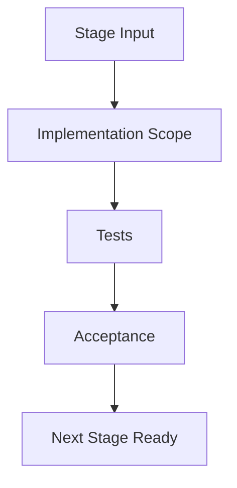

# Design Document: Stage 03 - 官方 conversations.json 导入

## Overview

解析官方 mapping/current_node，导入 primary path 并保存 source refs。

本阶段是整个系统路线图的一部分，必须只完成本 Stage 范围内的能力，不提前实现后续复杂能力。

## Architecture



## Components and Interfaces

### Scope

本阶段目标：

```text
解析官方 mapping/current_node，导入 primary path 并保存 source refs。
```

### Inputs

- 已完成前置阶段：Stage 02
- 已确认需求文档：`.kiro/specs/chat-archive-reader/requirements.md`
- 已确认总设计：`.kiro/specs/chat-archive-reader/design.md`

### Outputs

- 本阶段代码实现。
- 本阶段测试。
- 本阶段文档更新。
- 可进入下一 Stage 的验收记录。

## Data Models

本阶段如涉及数据库，应只修改与本阶段直接相关的表结构；不得为了未来功能提前加入无法测试的复杂字段。

## Error Handling

本阶段必须处理：

- 输入非法。
- 服务异常。
- 数据库错误。
- 可恢复失败。
- 用户可理解的错误提示。

## Testing Strategy

必须至少包含：

- Unit tests for core logic。
- Integration tests for touched API。
- Regression tests for previous stages。
- Stage acceptance checklist。

## Acceptance Criteria

- [ ] 本阶段所有 Scope 完成。
- [ ] 不破坏前置 Stage。
- [ ] 新增测试通过。
- [ ] 错误处理覆盖主要失败路径。
- [ ] 文档更新。
- [ ] 可以进入下一 Stage。

## Out of Scope

除非本 Stage 明确要求，否则不要实现：

```text
复杂多用户
语义搜索
PDF 导出
多人协作
完整 diff
AI 自动总结
完整分支 UI
复杂权限系统
复杂工具调用重放
```
